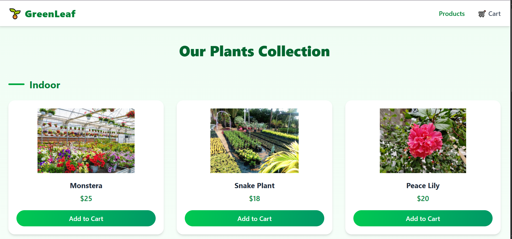
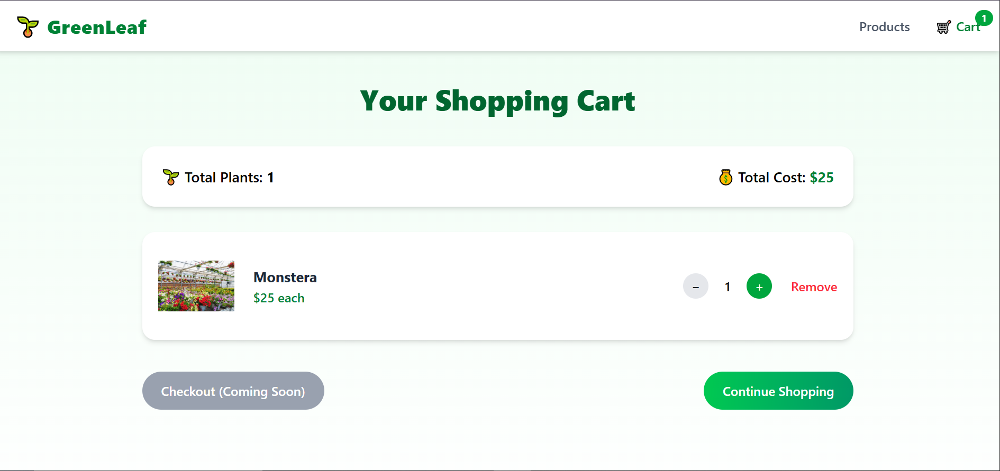

# 🌱 GreenLeaf — Houseplant Store


A modern, responsive **React + Redux Toolkit** e-commerce application for browsing and purchasing houseplants 🌿  
This project was built as part of a **peer-graded assignment**, following a detailed rubric and objective grading criteria.

---

## 🌟 Project Overview

**GreenLeaf** is a simple online plant store that allows users to:
- Browse plants by category
- Add plants to a shopping cart
- Manage quantities using global state
- View total items and total cost in real time

The project demonstrates:
- Component-based UI design
- Global state management with Redux Toolkit
- Client-side routing using React Router
- Responsive and modern UI with Tailwind CSS

---

## ✨ Features

### 🏠 Landing Page
- Full-screen hero section with background image
- Company name and short description
- “Get Started” button linking to the product listing page

### 🪴 Product Listing Page
- Displays **6 unique houseplants**
- Each plant includes:
  - Thumbnail image
  - Name
  - Price
  - Add to Cart button
- Plants grouped into **multiple categories**
- Add to Cart button behavior:
  - Adds plant to cart
  - Increases cart count in header
  - Becomes disabled after selection

### 🛒 Shopping Cart Page
- Displays:
  - Total number of plants
  - Total cost of items
- Each plant type shows:
  - Thumbnail
  - Name
  - Unit price
  - Quantity controls (increase / decrease)
- Delete button to remove plant from cart
- Checkout button (Coming Soon)
- Continue Shopping button linking back to products

### 🧭 Header Navigation
- Visible on product listing and cart pages
- Displays shopping cart icon with live item count
- Navigation between Products and Cart pages

---

## 🛠️ Tech Stack

- **React**
- **Redux Toolkit**
- **React Router**
- **Tailwind CSS**
- **Vite**

---

## 📁 Project Structure

```txt
src/
├── app/
│   └── store.js
│
├── features/
│   └── cart/
│       └── cartSlice.js
│
├── data/
│   └── plants.js
│
├── components/
│   ├── Header.jsx
│   └── PlantCard.jsx
│
├── pages/
│   ├── Landing.jsx
│   ├── Products.jsx
│   └── Cart.jsx
│
├── App.jsx
├── main.jsx
└── index.css
```
# 🚀 Getting Started

1️⃣ **Clone the repository**  
```bash
git clone https://github.com/your-username/greenleaf.git
```


## 2️⃣ Install dependencies
```
npm install
```
## 3️⃣ Start the development server
```
npm run dev
```

The app will be available at:

> http://localhost:5173

## 🧪 Redux State Management

 - Global state is managed using Redux Toolkit.

 - Cart State Includes:

 - C art items

 - Quantity per plant

 - Total number of items

 -  Total cost

 - Redux Actions:

 - Add plant to cart

 - Increase quantity

 - Decrease quantity

 - Remove plant from cart

## 📸 Screenshots
🪴 Product Listing


🛒 Shopping Cart



✅ Assignment Requirements Checklist

    ✔ Public GitHub repository
    ✔ Redux Toolkit used for global state
    ✔ Landing page with background image and CTA
    ✔ Product listing with categories
    ✔ Add-to-cart functionality
    ✔ Disabled add button after selection
    ✔ Header with live cart count
    ✔ Shopping cart with quantity controls
    ✔ Total price and total item calculation
    ✔ Navigation between all pages

>Developer : 
 `Waqas khan`
Built with React, Redux, and a love for plants 🌿

📄 License

This project was created for educational purposes as part of a peer-graded assignment.
